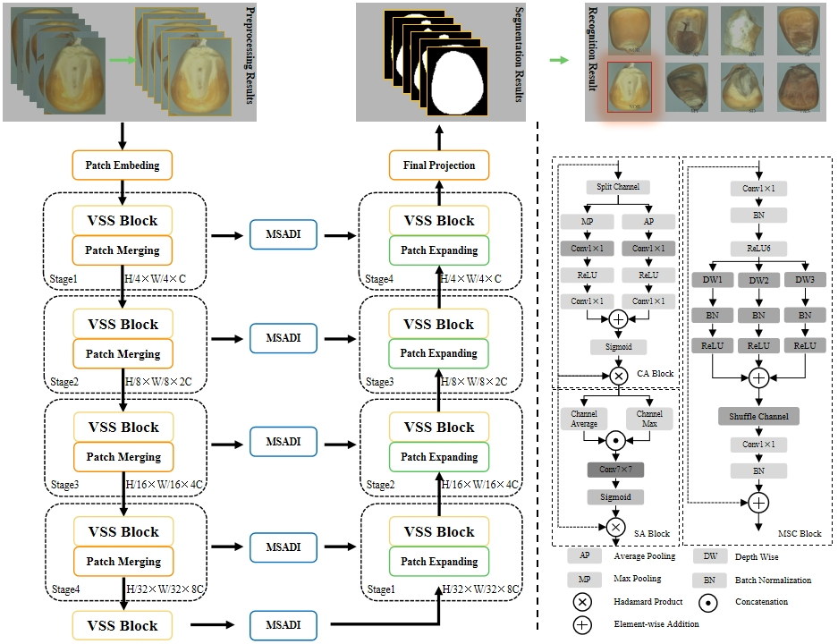

# VMUnet-MSADI

This is the official code repository for "VMUnet-MSADI：Visual Mamba UNet Fusion Multi-Scale Attention and Detail Infusion for Unsound Corn Kernels Recognition".



## training details

Our training code can refer to the VM-UnetV2 repository{[git link](https://github.com/nobodyplayer1/VM-UNetV2)}, please replace the files with those from this model.

If there are any issues, feel free to contact and raise an issue.

My email: kbzhao@stu.haut.edu.cn

## Cite:

```
@misc{2408.11289,
Author = {Kuibin Zhao and Chenxia Wan and Qinghui Zhang},
Title = {VMUnet-MSADI：Visual Mamba UNet Fusion Multi-Scale Attention and Detail Infusion for Unsound Corn Kernels Recognition},
Year = {2024},
}
```
