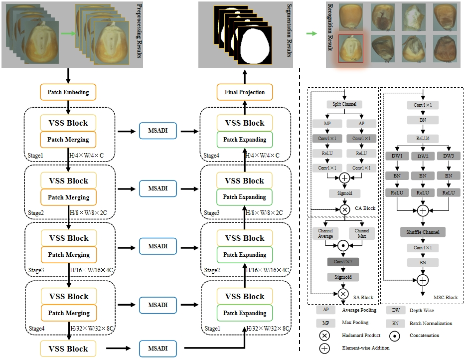

# VMUnet-MSADI

This is the official code repository for "VMUnet-MSADI：Visual Mamba UNet Fusion Multi-Scale Attention and Detail Infusion for Unsound Corn Kernels Recognition".



## dataset

The data that support the findings of this study are openly available in 【[Google Drive](https://drive.google.com/drive/folders/1VWebNwcIoZgVwaIprUP6ub4_9Hhc1TCT)】

## training details

Our training code can refer to the VM-UnetV2 repository【[VM-UnetV2](https://github.com/nobodyplayer1/VM-UNetV2)】, please replace the files with those from this model.

If there are any issues, feel free to contact and raise an issue.

Author email: kbzhao@stu.haut.edu.cn

## Cite:

```
{
Author = {Kuibin Zhao and Chenxia Wan and Qinghui Zhang},
Title = {VMUnet-MSADI：Visual Mamba UNet Fusion Multi-Scale Attention and Detail Infusion for Unsound Corn Kernels Recognition},
Year = {2024},
}
```
